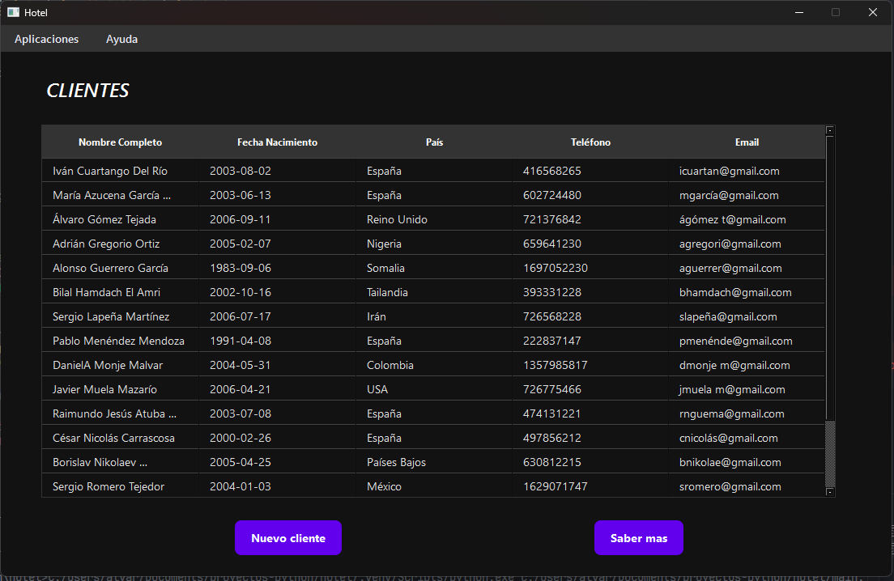

# Sistema de Gestión Hotelera - Aplicación de Escritorio PySide6


**Una aplicación de escritorio robusta para la gestión eficiente de reservas hoteleras, construida con Python y PySide6.**

### Descripción General

El **Sistema de Gestión Hotelera** es una aplicación de escritorio diseñada para simplificar y optimizar las operaciones de gestión en hoteles de diversos tamaños.  Desarrollada utilizando **Python 3.8+ y el potente framework de interfaz gráfica PySide6**, esta aplicación ofrece una **interfaz intuitiva y amigable** para gestionar eficientemente el corazón de cualquier hotel: las **reservas**.

**Importante:**  Esta es una **aplicación de escritorio**, no una aplicación web.  Está diseñada para ser instalada y ejecutada directamente en sistemas operativos Windows, macOS y Linux.

Si bien el proyecto se centra actualmente en la **gestión de reservas**,  la arquitectura está pensada para crecer y abarcar otras áreas clave de la gestión hotelera en el futuro.

### Características Principales

*   **Gestión Integral de Reservas:**
    *   **Creación Sencilla e Intuitiva:**  Interfaz gráfica clara para crear nuevas reservas de forma rápida, registrando información esencial del cliente, fechas de estancia y detalles de la reserva.
    *   **Modificación y Cancelación:**  Flexibilidad para modificar detalles de reservas existentes o cancelarlas cuando sea necesario, manteniendo el sistema siempre actualizado.
    *   **Consulta y Listado Eficiente:**  Potentes herramientas de búsqueda y filtrado para encontrar reservas específicas o generar listados de reservas por diversos criterios (fecha, cliente, etc.).
    *   **Gestión de Clientes:**  Registro y almacenamiento de la información de los clientes asociados a las reservas, facilitando la gestión de la base de datos de huéspedes.
    *   **Control de Disponibilidad (Básico):**  Implementación inicial del control de disponibilidad de habitaciones al realizar reservas, evitando la sobreventa y optimizando la ocupación.

*   **Gestión de Usuarios (Básica):**
    *   **Sistema de Inicio de Sesión:**  Seguridad básica implementada mediante un sistema de inicio de sesión para proteger el acceso a la aplicación.
    *   **Configuracdor de base de datos:** Si abre la aplicacion donde no este escuchando la base de datos, le pedira que configure la base de datos que tendra que hacerse ejecutando el archivo database.sql que tiene el proyecto

*   **Interfaz de Usuario de Escritorio con PySide6:**
    *   **Diseño Intuitivo y Fácil de Usar:**  Interfaz gráfica moderna y amigable construida con PySide6, pensada para facilitar la interacción del usuario y minimizar la curva de aprendizaje.
    *   **Aplicación de Escritorio Robusta:**  Benefíciese de la estabilidad y rendimiento de una aplicación de escritorio,  ejecutándose directamente en su sistema operativo sin depender de un navegador web.

*   **Base de Datos MySQL:**
    *   **Almacenamiento Robusto y Escalable:**  Utilización de MySQL como sistema de gestión de base de datos para almacenar de forma segura y eficiente toda la información de la aplicación, desde reservas hasta usuarios.
    *   **Esquema de Base de Datos Incluido:**  Se proporciona un archivo `database.sql` con el esquema básico de la base de datos MySQL, facilitando la configuración inicial.

### Saber Más sobre el Proyecto

Este proyecto representa una **sólida base para un sistema de gestión hotelera de escritorio**,  enfocado inicialmente en la funcionalidad esencial de **gestión de reservas**.  Está **especialmente diseñado para hoteles que prefieren una solución de software instalable y de alto rendimiento** en sus equipos locales,  en lugar de depender de aplicaciones web basadas en navegador.

La elección de **PySide6** garantiza una **interfaz gráfica nativa y responsiva**,  mientras que **Python proporciona la potencia y flexibilidad** para la lógica de negocio y la gestión de datos.  La utilización de **MySQL asegura la robustez y escalabilidad** del almacenamiento de información.

Si bien la **gestión de habitaciones** y la **generación de informes** son áreas **planificadas para el futuro**,  actualmente se encuentran **en un estado muy temprano de desarrollo o no implementadas**.  El proyecto se presenta como una **excelente plataforma para aprender desarrollo de aplicaciones de escritorio con Python y PySide6**,  y para **colaborar en la expansión de sus funcionalidades**.

### Tecnologías Utilizadas

*   **Lenguaje de Programación:**  **Python 3.8+**  (Recomendado Python 3.11)
*   **Framework de Interfaz Gráfica (GUI):**  **PySide6** (anteriormente PyQt6)
*   **Base de Datos:**  **MySQL**
*   **Control de Versiones:**  **Git**

### Instalación

Para ejecutar el Sistema de Gestión Hotelera en tu entorno local, sigue estos pasos:

1.  **Prerrequisitos:**
    *   Asegúrate de tener **Python 3.8 o superior** instalado en tu sistema.
    *   **Instala PySide6:**  Abre una terminal o línea de comandos y ejecuta: `pip install PySide6`
    *   Ten **MySQL Server** instalado y en ejecución.

2.  **Clonar el Repositorio:**
    ```bash
    git clone [https://github.com/alvarowau/hotel.git](https://github.com/alvarowau/hotel.git)
    cd hotel
    ```

3.  **Crear Entorno Virtual (Recomendado):**
    ```bash
    python3 -m venv venv
    source venv/bin/activate   # En Linux/macOS
    venv\Scripts\activate  # En Windows
    ```

4.  **Instalar Dependencias:**
    ```bash
    pip install -r requirements.bxt
    ```

5.  **Crear Base de Datos MySQL:**
    *   Utiliza un cliente MySQL (línea de comandos, phpMyAdmin, etc.) para crear una base de datos llamada, por ejemplo, `hotel_db`.
    *   Importa el esquema desde `database.sql` a la base de datos `hotel_db`.

6.  **Configurar Conexión a la Base de Datos:**
    *   Localiza el archivo de configuración de la base de datos en el proyecto (revisa los archivos `.py`).
    *   Edita el archivo con los detalles de conexión a tu MySQL (host, usuario, contraseña, nombre de la base de datos `hotel_db`).

7.  **Ejecutar la Aplicación:**
    ```bash
    python main.py
    ```
    La aplicación de escritorio se iniciará.

### Instrucciones de Uso

1.  **Ejecutar la aplicación.**
2.  **Iniciar sesión** con un usuario existente (o crea uno si la funcionalidad está implementada).
3.  **Navegar por la interfaz** utilizando el menú y los botones.
4.  **Gestionar Reservas:**  Utiliza la sección de "Reservas" para crear, modificar, consultar y cancelar reservas.
5.  **Explorar otras secciones:**  Aunque la funcionalidad de "Habitaciones" e "Informes" es limitada, puedes explorar las interfaces visuales correspondientes.

### Contribuciones

¡Las contribuciones son bienvenidas y altamente valoradas\!  Si deseas colaborar con el proyecto, considera contribuir en las siguientes áreas:

*   **Desarrollo Completo de la Gestión de Habitaciones:**  Implementar la funcionalidad CRUD completa para la gestión de habitaciones (creación, edición, eliminación y listado), integrándola con la base de datos y la interfaz de usuario.
*   **Implementación de Informes:**  Desarrollar la funcionalidad de generación de informes útiles para la gestión hotelera (ocupación, ingresos, etc.) y crear interfaces para visualizarlos.
*   **Mejoras de la Interfaz de Usuario (UI/UX):**  Refinar el diseño de la interfaz PySide6 para mejorar la usabilidad, accesibilidad y la experiencia general del usuario.
*   **Implementación de Funcionalidades Adicionales:**  Añadir nuevas características relevantes para la gestión hotelera, como gestión de servicios, facturación, etc.
*   **Pruebas y Robustez:**  Implementar pruebas unitarias y de integración para asegurar la calidad del código y mejorar la robustez de la aplicación.
*   **Documentación:**  Mejorar la documentación del código, añadir comentarios y generar documentación para usuarios y desarrolladores.

Para contribuir:

1.  **Fork del repositorio.**
2.  **Crear una rama** para tu contribución (ej: `feature/gestion-habitaciones`).
3.  **Realizar tus cambios y commits.**
4.  **Subir tu rama a tu fork.**
5.  **Abrir un Pull Request** hacia la rama `main` del repositorio principal.

### Licencia

Este proyecto se distribuye bajo la Licencia MIT. Consulta el archivo `LICENSE` para más detalles (Actualmente no existe el archivo LICENSE en el repositorio, se recomienda añadir uno).

### Autor

[alvarowau]


## Algunas fotos


Esta pantalla aparecerá al inicio si la aplicación no puede conectarse a la base de datos configurada. Aquí, podrás especificar los detalles de conexión a la base de datos MySQL, incluyendo el host, puerto, usuario, contraseña y nombre de la base de datos (`hotel_db`). Asegúrate de que la base de datos esté en ejecución y que el esquema `database.sql` haya sido importado correctamente.



Esta es la pantalla principal para la gestión de clientes, donde podrás ver, agregar, editar y eliminar información de los clientes.


Esta pantalla muestra información sobre la aplicación, incluyendo la versión, el autor y otros detalles relevantes.


Esta es la pantalla de inicio de sesión, donde los usuarios pueden ingresar sus credenciales para acceder a la aplicación. Aparecerá después de que la conexión a la base de datos se haya configurado correctamente.
